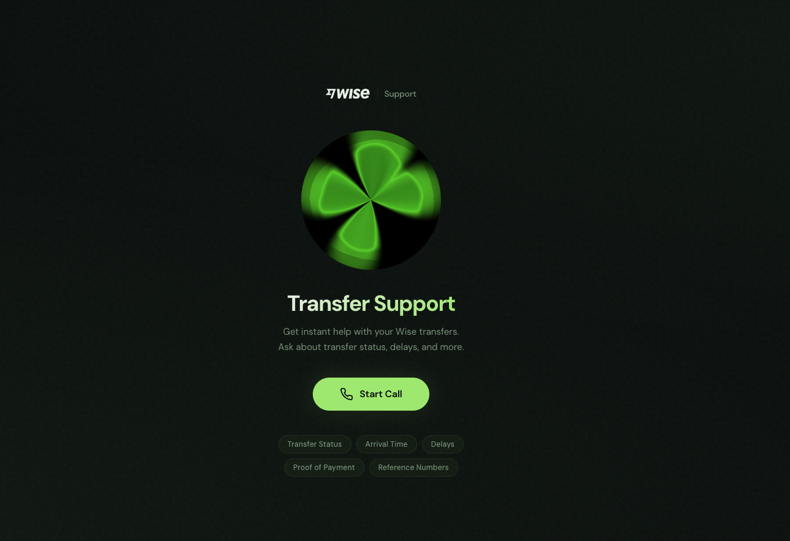
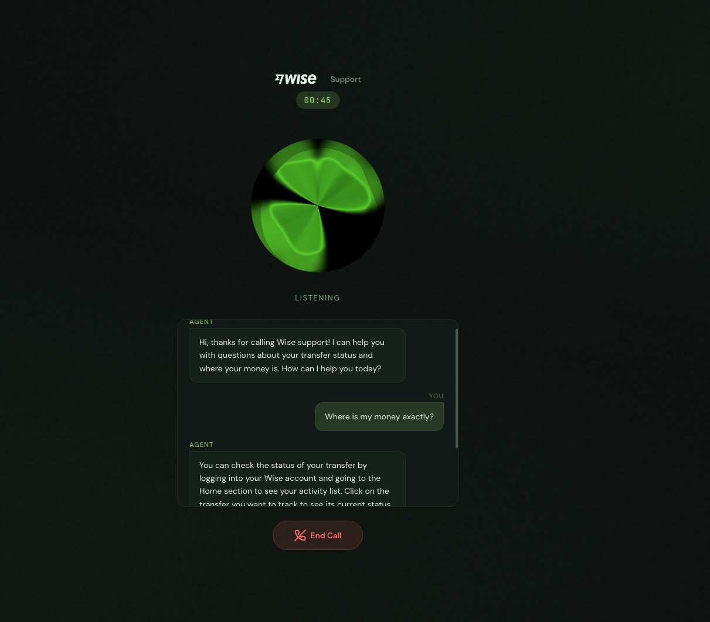

# Wise Voice Support Agent

Voice AI agent for Wise "Where is my money?" customer support. Handles incoming calls via phone (Twilio SIP) and web, answers 6 FAQ topics, deflects off-topic questions and disconnects.

<p align="center">
  
  &nbsp;&nbsp;
  
</p>

## Architecture

```
Phone (PSTN) → Twilio SIP Trunk → LiveKit SIP Gateway → AgentSession
Web Client   → LiveKit Room     → AgentSession
```

Single-file agent (`src/agent.py`) with FAQ knowledge baked into the system prompt — no RAG needed for 6 topics. LLM handles fuzzy intent matching natively.

**Voice Pipeline:** Deepgram Nova 3 (STT) → OpenAI GPT-4.1-mini (LLM) → ElevenLabs Turbo v2 (TTS), orchestrated by LiveKit Agents SDK with Silero VAD.

**Call Termination:** LLM decides when to deflect, delivers goodbye message, then `end_call` function tool polls `current_speech.done()` before deleting the LiveKit room — disconnects both SIP and web participants cleanly.

**Post-Call Summaries:** On session close, the conversation history is sent to GPT-4.1-mini to generate a structured JSON summary (intent, topics, resolution, sentiment, follow-up flag) saved to `call_summaries/`.

## Project Structure

```
src/agent.py                # Agent: system prompt, WiseSupportAgent class, entrypoint
sip/                        # LiveKit inbound trunk + dispatch rule configs
web/app/page.tsx            # Call UI — LiveKitRoom, transcript, state management
web/app/api/token/route.ts  # Token endpoint with RoomAgentDispatch
web/components/ui/orb.tsx   # ElevenLabs 3D orb (Three.js + GLSL shaders)
```

## Running

```bash
# Agent
uv sync && uv run python src/agent.py download-files
uv run python src/agent.py dev      # development
uv run python src/agent.py start    # production

# Web UI
cd web && pnpm install && pnpm dev
```

Requires `.env.local` with `LIVEKIT_URL`, `LIVEKIT_API_KEY`, `LIVEKIT_API_SECRET`, `DEEPGRAM_API_KEY`, `OPENAI_API_KEY`, `ELEVEN_API_KEY`.

## Deployment

- **Agent:** `pm2 start "uv run python src/agent.py start" --name wise-agent`
- **Web:** Vercel (root directory: `web`)
